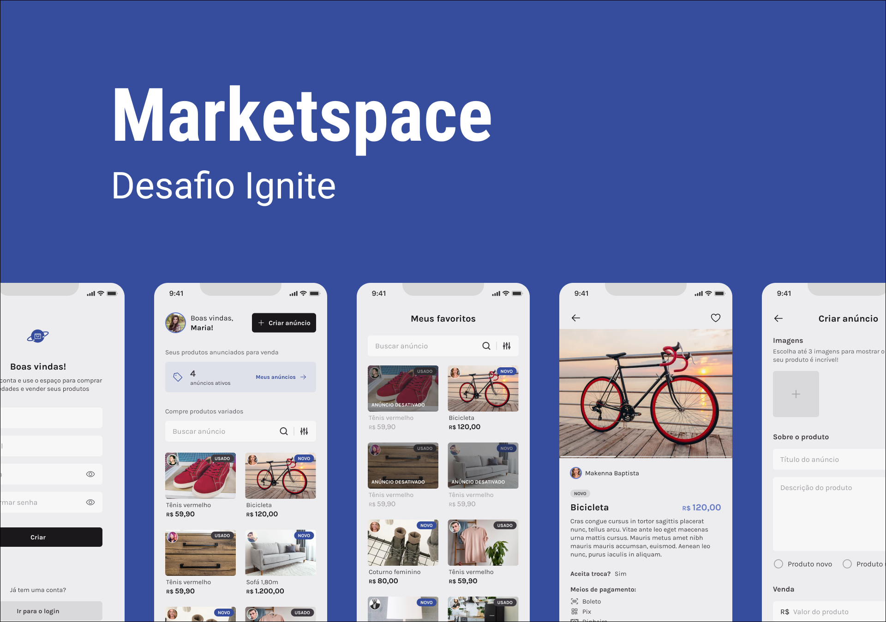

<h1 style="text-align: center; font-weight: bold;">Market Space</h1>

<div align="center" >
  
</div>

## Sobre o Projeto

Market Space consiste em um E-commerce onde o usuário tem acesso a anúncios de outros usuários e ele também pode anunciar o seu próprio produto. O usuário também pode fazer algumas ações como:

- Criar uma conta
- Buscar anúncios
- Criar um anúncio
- Desativar um anúncio
- Editar um anúncio
- Remover um anúncio

E entre outros.

### Tecnologias Usadas

- [React Native](https://reactnative.dev/)
- [Expo](https://expo.io/)
- [TypeScript](https://www.typescriptlang.org/)
- [Native Base](https://nativebase.io/)
- [React Navigation](https://reactnavigation.org/)
- [Expo-Vector-Icons](https://icons.expo.fyi/)
- [Async Storage](https://react-native-async-storage.github.io/async-storage/)
- [Axios](https://axios-http.com/ptbr/docs/intro)
- [React Hook Form](https://react-hook-form.com/)
- [React Native Animated Carousel](https://github.com/dohooo/react-native-reanimated-carousel)

### Como rodar a aplicação

```bash
# Clone este repositório
$ git clone https://github.com/marrcelosantana/market-space-app
# Acesse a pasta do projeto
$ cd market-space-app
# Instale as dependências
$ npm install
# ou
$ yarn
# Execute a aplicação em modo de desenvolvimento
$ expo start


# Clone o backend desta aplicação
$ git clone https://github.com/marrcelosantana/market-space-api
# Acesse a pasta do projeto
$ cd market-space-api
# Instale as dependências
$ npm install
# Execute a aplicação em modo de desenvolvimento
$ npm run dev

```

### Aplicação em funcionamento

|             Parte I              |             Parte II             |
| :------------------------------: | :------------------------------: |
|  |  |
